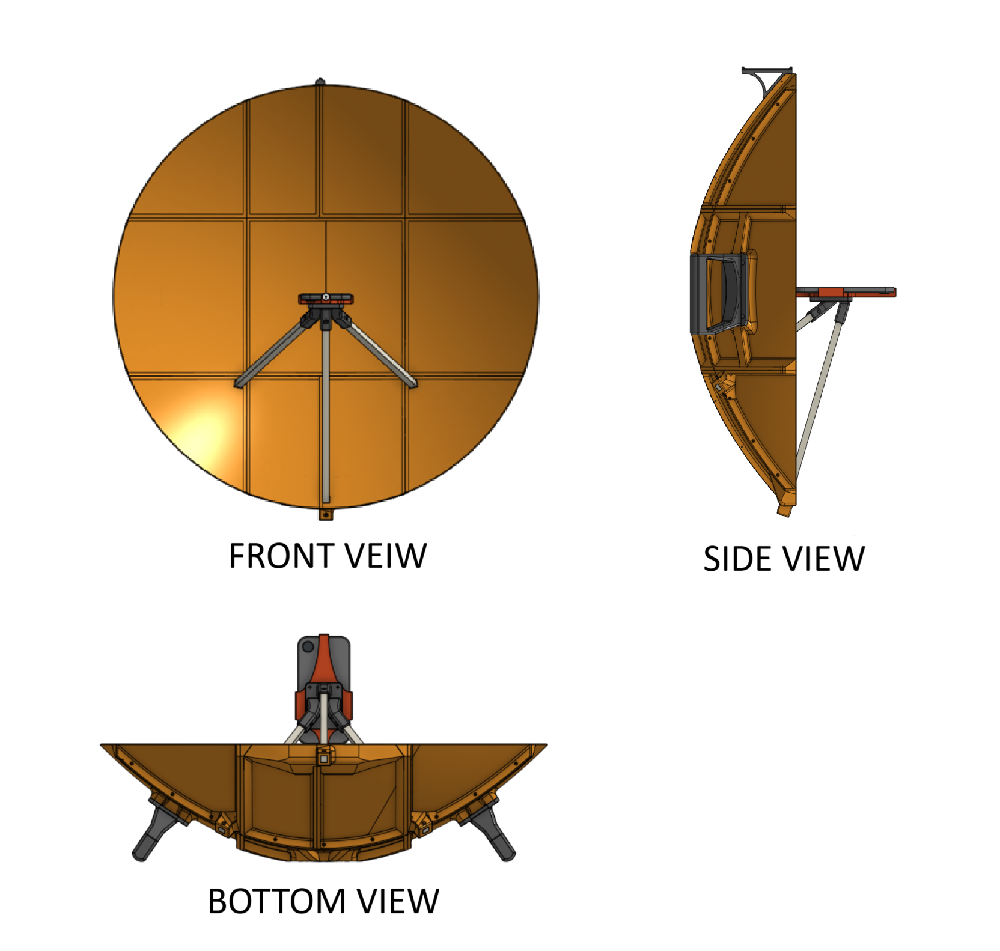
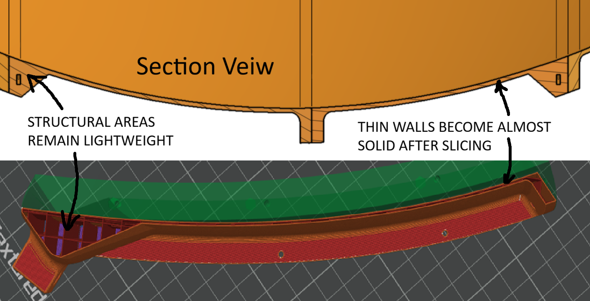

# Parabolic Microphone / Speaker

An exploration of designing a parabolic speaker / microphone, then testing its capabilities.  
This project was inspired by learning about the special properties of paraboloids in multivariable calculus.

Skills:
- Onshape
- Designing for 3D printing
- Designing for ease of assembly

****
The following I learned in class:
Any ray that enters a parabola parallel to its axis is reflected toward the focus, and any ray emitted from the focus exits the parabola parallel to the axis.

*As a challenge to myself, no outside research was conducted beyond this theorem. Everything that follows is based on my own reasoning, design process, and work.*
****
As a speaker, a paraboloid can be used to direct sound waves into a narrow, nearly parallel beam, reducing sound spread and loss. As a microphone, the same geometry focuses incoming sound waves toward a central point, increasing the effective signal strength.

## Desgin and Fabrication

The design was created in Onshape and divided into nine square sections, which were printed individually and then assembled into the full dish. To reduce filament use, minimal print settings were used: 10% infill and a single wall layer.

Effectiveness of both the microphone and speaker could be improved by making the surface the sound waves interact with as rigid as possible. The logical step in response to this then was to increase material density at the point of contact (the front surface of the dish) and bring the back wall was moved forward to nearly meet the front wall, increasing the effective thickness of the reflecting surface from about 0.4mm to about 1.2 mm.

Final Design printed and assembled:

## Capabilites of Parabolic Speaker/Microphone
A few inital tests were taken to verify the effectivness of the speaker, with varying sucess:
The Directional Speaker worked much better than expected, but due to noise the directional microphone's performance was poor. Demonstrations of both capabilities shown in following video:
[Summary of Inital Testing: https://youtu.be/Xewug80HgfE ](https://youtu.be/Xewug80HgfE)

A follow up of more rigorous tests were attempted, but with ought any expensive equipment it was not possible to get any quantifiable data from the results. 

